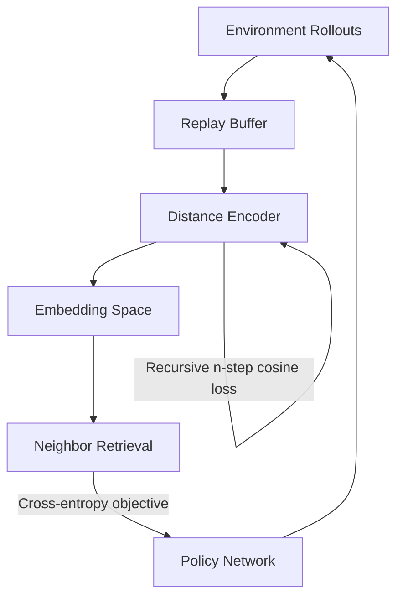
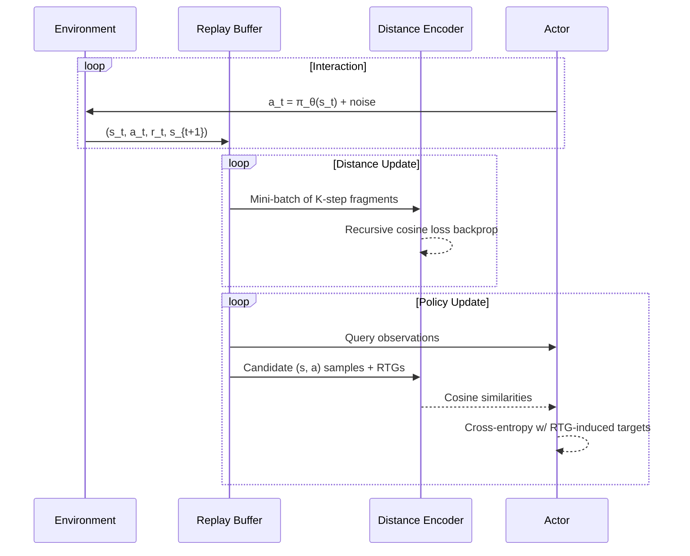

# DistanceRL

> **DistanceRL** proposes a distance-aware alternative to value-based reinforcement learning. The repository contains the research prototype of the DistRL algorithm together with classic PPO/SAC/TD3/DDPG baselines used during experimentation.

## Table of contents
1. [Project overview](#project-overview)
2. [The DistRL algorithm](#the-distrl-algorithm)
3. [Installation](#installation)
4. [Quick start](#quick-start)
5. [Offline RL with Minari datasets](#offline-rl-with-minari-datasets)
6. [Configuration reference](#configuration-reference)
7. [Repository structure](#repository-structure)
8. [Logging & experiment tracking](#logging--experiment-tracking)
9. [Citation](#citation)

---

## Project overview
DistanceRL is motivated by the observation that the geometry of state–action trajectories contains richer information than scalar value estimates. DistRL learns an embedding function that maps rollout fragments into a distance space. Policy updates are driven by the similarity between the current policy's embeddings and high-return neighbors sampled from the replay buffer.

### Why DistRL?
- **Return-aware embedding space** – the learned distance encoder predicts multi-step, return-to-go aware embeddings instead of raw Q-values.
- **Policy updates via retrieval** – actor gradients are guided by cosine similarity against the best historical behaviors, providing stable training without explicit critic targets.
- **Modular experimentation** – the repo ships with plug-and-play baselines (PPO, SAC, TD3, DDPG) for head-to-head comparisons on Gymnasium continuous-control tasks.

### Conceptual overview


---

## The DistRL algorithm
DistRL alternates between updating a distance model and a deterministic actor:

1. **Distance model** `D(s, a)` embeds state–action pairs. It is trained with a *recursive n-step cosine loss* that enforces temporal consistency over `K`-step sequences while weighting returns through a `γ`-shaped filter.
2. **Policy update** leverages the distance model as a retrieval module:
   - Sample a mini-batch of current observations and a larger comparison set from the replay buffer.
   - Embed current actor actions and comparison actions with `D`.
   - Compute cosine similarities and select the top-`K` comparison neighbors per query.
   - Convert their return-to-go values into a soft target distribution.
   - Optimize the actor by minimizing the cross-entropy between the target distribution and the similarity-induced distribution.
3. **Target networks & exploration** – soft-updated target copies of both networks provide stability, while exploration uses either Ornstein–Uhlenbeck or scheduled Gaussian noise.

### Training loop highlights
- Replay buffer stores full transitions and return-to-go statistics for retrieval-driven updates.
- Distance training and policy training begin after configurable warm-up periods.
- Periodic evaluation rollouts monitor performance and snapshot the best checkpoints.

### Algorithm pseudo-code


---

## Installation
1. **Clone the repository**
   ```bash
   git clone https://github.com/stavrosorf/DistanceRL.git
   cd DistanceRL
   ```
2. **Create a Python ≥3.10 environment** (conda or venv) and install dependencies:
   ```bash
   pip install -r requirements.txt
   # or install the minimal set for DistRL
   pip install gymnasium[box2d] torch wandb pyyaml numpy scipy
   ```
3. **Optional extras** – enable MuJoCo support via `pip install mujoco` and `pip install gymnasium[mujoco]`.

---

## Quick start
### Train DistRL on LunarLanderContinuous
```bash
python main.py --env-id LunarLanderContinuous-v3 \
  --algo DistRL --total-steps 2_000_000 \
  --device cuda --log_to_wandb --exp_prefix dist_experiment
```

### Compare against PPO
```bash
python main.py --env-id LunarLanderContinuous-v3 \
  --algo PPO --total-steps 2_000_000 \
  --device cuda --log_to_wandb --exp_prefix ppo_baseline
```

### Resume from a saved checkpoint
```bash
python main.py --env-id BipedalWalker-v3 --algo DistRL \
  --load-from ./saved_models/best_actor.pth
```

### Visualize evaluation episodes
```bash
python main.py --env-id Hopper-v4 --algo DistRL --render True --eval-episodes 10
```

### Atari baselines with Stable-Baselines3

The repository also ships a helper script for launching *sticky-action* Atari runs with SB3 baselines. Make sure the extra
dependencies are installed before launching experiments:

```bash
pip install gymnasium[atari] AutoROM.accept-rom-license
# Optional: distributional DQN variants
pip install sb3-contrib
```

The `classic_rl/sb3_atari_train.py` entrypoint mirrors the logging flow of `sb3_train.py` while pulling SOTA hyperparameters
from `classic_rl/hyperparams/atari/`.

```bash
# Train DQN on Breakout with WandB/TensorBoard logging and evaluation every 100k steps
python classic_rl/sb3_atari_train.py --env-id ALE/Breakout-v5 --algo dqn \
  --total-timesteps 10000000 --device cuda --seed 42 \
  --tensorboard-log ./logs/atari --output-dir ./runs/breakout_dqn

# Launch PPO with 8 parallel environments on Pong
python classic_rl/sb3_atari_train.py --env-id ALE/Pong-v5 --algo ppo --n-envs 8 \
  --total-timesteps 5000000 --device cuda
```

Per-environment settings (buffer sizes, learning rate schedules, evaluation cadence, etc.) can be customised by editing the
YAML files in `classic_rl/hyperparams/atari/` or by overriding CLI flags such as `--eval-freq` and `--n-envs`.

---

## Offline RL with Minari datasets

DistRL can be trained on **offline datasets** without any environment interaction using the Minari dataset library.

### Quick Start with Offline RL

1. **Install Minari** (if not already installed):
   ```bash
   pip install minari
   ```

2. **List available datasets**:
   ```bash
   python list_minari_datasets.py
   ```

3. **Train on HalfCheetah-Medium dataset**:
   ```bash
   python offline_main.py \
     --dataset halfcheetah-medium-v0 \
     --device cuda \
     --total-iterations 100000 \
     --batch-size 256 \
     --K 20 \
     --rtg-enabled \
     --log-to-wandb
   ```

4. **Quick test** (minimal training):
   ```bash
   bash quickstart_offline.sh
   ```

### How Offline Training Works

The offline training pipeline:

1. **Loads a Minari dataset** (e.g., expert demonstrations or medium-quality trajectories)
2. **Converts to RTGRolloutBuffer** which automatically calculates:
   - Full Monte Carlo **Return-To-Go (RTG)** for each state
   - **n-step returns** for lower-variance estimates
3. **Trains purely from the buffer** without environment interaction
4. **Evaluates periodically** on the actual environment to measure generalization

### Key Differences from Online Training

- **No exploration**: Agent learns only from fixed offline data
- **Immediate training**: No warm-up period collecting random data
- **Iteration-based**: Training runs for a fixed number of iterations rather than environment steps
- **Pre-computed returns**: RTG and n-step returns are calculated when loading the dataset

### Available Datasets

Common Minari datasets for continuous control:

- **HalfCheetah**: `halfcheetah-medium-v0`, `halfcheetah-expert-v0`
- **Hopper**: `hopper-medium-v0`, `hopper-expert-v0`
- **Walker2d**: `walker2d-medium-v0`, `walker2d-expert-v0`
- **Ant**: `ant-medium-v0`, `ant-expert-v0`

See [OFFLINE_README.md](OFFLINE_README.md) for comprehensive documentation on offline training.

### Batch Offline Experiments

Run multiple offline experiments with different hyperparameters:

```bash
bash batch_offline_runner.sh
```

Edit the script to customize datasets, seeds, and hyperparameters.

---

## Configuration reference
Key CLI arguments (see `main.py` for the full list):

| Argument | Description |
| --- | --- |
| `--K` | Number of n-step transitions used in the recursive distance loss. |
| `--policy-training-start` | Environment steps before actor updates begin. |
| `--val-training-start` | Environment steps before distance encoder updates begin. |
| `--comp-samples` | Size of the comparison pool sampled during retrieval. |
| `--value-model-type` | Choose between `LSTM` and `Transformer` encoders. |
| `--dynamic-beta` | Enable adaptive scaling of the distance loss. |
| `--noise-type` | Exploration noise: `OU` (Ornstein–Uhlenbeck) or `Sched` (scheduled Gaussian). |

Hyperparameters for classic baselines live in `classic_rl/hyperparams/<algo>.yaml`. DistRL-specific defaults are defined in `dist_rl/hyperparams`.

---

## Repository structure
```
├── classic_rl/           # PPO/SAC/TD3/DDPG wrappers and configs
├── dist_rl/
│   ├── distRL.py         # Core DistRL agent and training loop
│   ├── models.py         # Actor & distance encoder architectures
│   ├── loss.py           # Recursive n-step cosine loss implementation
│   ├── utils.py          # Replay buffer (incl. RTGRolloutBuffer), noise, helpers
│   └── hyperparams/     # YAML defaults for DistRL variants
├── batch_runner.py       # Utility for batched experiment launches
├── runner.py             # Legacy experiment entry point
├── main.py               # Primary CLI for online RL training
├── offline_main.py       # CLI for offline RL training with Minari
├── list_minari_datasets.py  # Utility to list available Minari datasets
├── batch_offline_runner.sh  # Batch script for offline experiments
├── quickstart_offline.sh    # Quick start script for offline RL
├── OFFLINE_README.md     # Comprehensive offline RL documentation
└── requirements.txt      # Python dependencies
```

---

## Logging & experiment tracking
- Pass `--log_to_wandb` to stream metrics (losses, gradients, evaluation returns) to [Weights & Biases](https://wandb.ai/).
- Checkpoints are stored under `./saved_models/` with `best` and `final` snapshots.
- Evaluation frequency is governed by `--eval-freq`; during evaluations the actor runs without exploration noise.

---

## Citation
--

---
