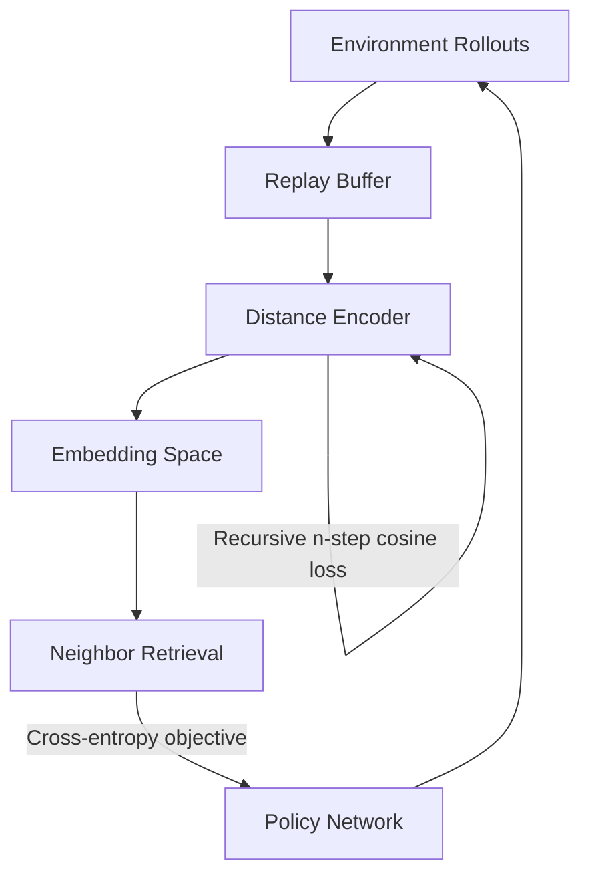
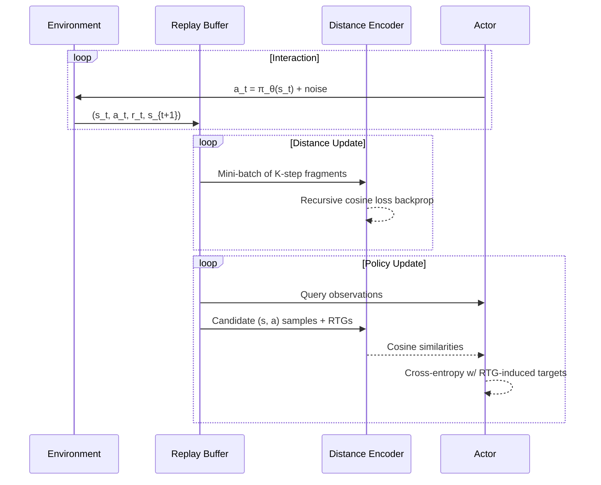

# DistanceRL

> **DistanceRL** proposes a distance-aware alternative to value-based reinforcement learning. The repository contains the research prototype of the DistRL algorithm together with classic PPO/SAC/TD3/DDPG baselines used during experimentation.

## Table of contents
1. [Project overview](#project-overview)
2. [The DistRL algorithm](#the-distrl-algorithm)
3. [Installation](#installation)
4. [Quick start](#quick-start)
5. [Configuration reference](#configuration-reference)
6. [Repository structure](#repository-structure)
7. [Logging & experiment tracking](#logging--experiment-tracking)
8. [Citation](#citation)

---

## Project overview
DistanceRL is motivated by the observation that the geometry of state–action trajectories contains richer information than scalar value estimates. DistRL learns an embedding function that maps rollout fragments into a distance space. Policy updates are driven by the similarity between the current policy's embeddings and high-return neighbors sampled from the replay buffer.

### Why DistRL?
- **Return-aware embedding space** – the learned distance encoder predicts multi-step, return-to-go aware embeddings instead of raw Q-values.
- **Policy updates via retrieval** – actor gradients are guided by cosine similarity against the best historical behaviors, providing stable training without explicit critic targets.
- **Modular experimentation** – the repo ships with plug-and-play baselines (PPO, SAC, TD3, DDPG) for head-to-head comparisons on Gymnasium continuous-control tasks.

### Conceptual overview


---

## The DistRL algorithm
DistRL alternates between updating a distance model and a deterministic actor:

1. **Distance model** `D(s, a)` embeds state–action pairs. It is trained with a *recursive n-step cosine loss* that enforces temporal consistency over `K`-step sequences while weighting returns through a `γ`-shaped filter.
2. **Policy update** leverages the distance model as a retrieval module:
   - Sample a mini-batch of current observations and a larger comparison set from the replay buffer.
   - Embed current actor actions and comparison actions with `D`.
   - Compute cosine similarities and select the top-`K` comparison neighbors per query.
   - Convert their return-to-go values into a soft target distribution.
   - Optimize the actor by minimizing the cross-entropy between the target distribution and the similarity-induced distribution.
3. **Target networks & exploration** – soft-updated target copies of both networks provide stability, while exploration uses either Ornstein–Uhlenbeck or scheduled Gaussian noise.

### Training loop highlights
- Replay buffer stores full transitions and return-to-go statistics for retrieval-driven updates.
- Distance training and policy training begin after configurable warm-up periods.
- Periodic evaluation rollouts monitor performance and snapshot the best checkpoints.

### Algorithm pseudo-code


---

## Installation
1. **Clone the repository**
   ```bash
   git clone https://github.com/stavrosorf/DistanceRL.git
   cd DistanceRL
   ```
2. **Create a Python ≥3.10 environment** (conda or venv) and install dependencies:
   ```bash
   pip install -r requirements.txt
   # or install the minimal set for DistRL
   pip install gymnasium[box2d] torch wandb pyyaml numpy scipy
   ```
3. **Optional extras** – enable MuJoCo support via `pip install mujoco` and `pip install gymnasium[mujoco]`.

---

## Quick start
### Train DistRL on LunarLanderContinuous
```bash
python main.py --env-id LunarLanderContinuous-v3 \
  --algo DistRL --total-steps 2_000_000 \
  --device cuda --log_to_wandb --exp_prefix dist_experiment
```

### Compare against PPO
```bash
python main.py --env-id LunarLanderContinuous-v3 \
  --algo PPO --total-steps 2_000_000 \
  --device cuda --log_to_wandb --exp_prefix ppo_baseline
```

### Resume from a saved checkpoint
```bash
python main.py --env-id BipedalWalker-v3 --algo DistRL \
  --load-from ./saved_models/best_actor.pth
```

### Visualize evaluation episodes
```bash
python main.py --env-id Hopper-v4 --algo DistRL --render True --eval-episodes 10
```

---

## Configuration reference
Key CLI arguments (see `main.py` for the full list):

| Argument | Description |
| --- | --- |
| `--K` | Number of n-step transitions used in the recursive distance loss. |
| `--policy-training-start` | Environment steps before actor updates begin. |
| `--val-training-start` | Environment steps before distance encoder updates begin. |
| `--comp-samples` | Size of the comparison pool sampled during retrieval. |
| `--value-model-type` | Choose between `LSTM` and `Transformer` encoders. |
| `--dynamic-beta` | Enable adaptive scaling of the distance loss. |
| `--noise-type` | Exploration noise: `OU` (Ornstein–Uhlenbeck) or `Sched` (scheduled Gaussian). |

Hyperparameters for classic baselines live in `classic_rl/hyperparams/<algo>.yaml`. DistRL-specific defaults are defined in `dist_rl/hyperparams`.

---

## Repository structure
```
├── classic_rl/           # PPO/SAC/TD3/DDPG wrappers and configs
├── dist_rl/
│   ├── distRL.py         # Core DistRL agent and training loop
│   ├── models.py         # Actor & distance encoder architectures
│   ├── loss.py           # Recursive n-step cosine loss implementation
│   ├── utils.py          # Replay buffer, noise processes, helpers
│   └── hyperparams/     # YAML defaults for DistRL variants
├── batch_runner.py       # Utility for batched experiment launches
├── runner.py             # Legacy experiment entry point
├── main.py               # Primary CLI to launch training
└── requirements.txt      # Python dependencies
```

---

## Logging & experiment tracking
- Pass `--log_to_wandb` to stream metrics (losses, gradients, evaluation returns) to [Weights & Biases](https://wandb.ai/).
- Checkpoints are stored under `./saved_models/` with `best` and `final` snapshots.
- Evaluation frequency is governed by `--eval-freq`; during evaluations the actor runs without exploration noise.

---

## Citation
--

---
